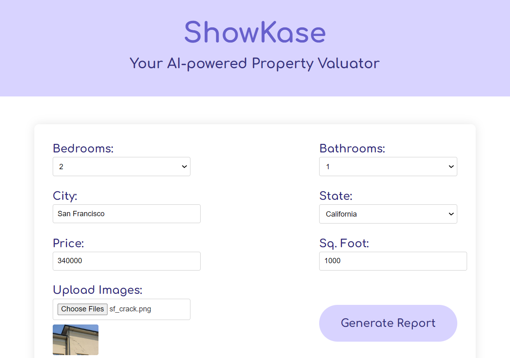
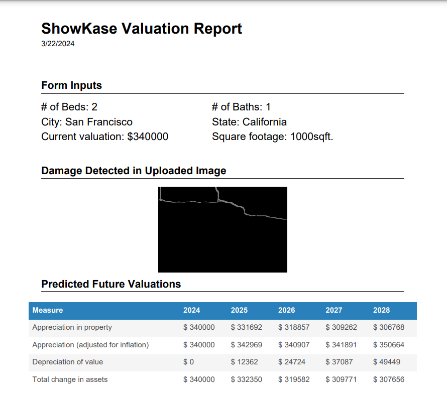

# ShowKASE

Welcome to ShowKase! This project aims to analyze the quality of real estate property as a potential investment for buyers, taking into account factors such as appreciation, depreciation, inflation adjustment, potential rental income etc. [ShowKase-Workers](https://github.com/AnantharamanSI/ShowKase-Workers) deploys the Cloudflare Workers to generate reports for this tool.



## How To
The interface is simple:
1. Fill in a few details about the property
2. Upload images of any damage you see on the property
3. Generate an assesment report that factors damages into the property's viability to appreciate in value over time.



You have the choice of generating the report on either the local server, or on Cloudflare Workers using [this repository](https://github.com/AnantharamanSI/ShowKase-Workers). This can be toggled using the variable `useCloudflareWorkers` at the top of `src/client/src/App.js`.

If you decide to use Workers, you will be using the default Worker currently referenced by `workersURL` at the top of `src/client/src/App.js`. Alternatively, you can replace that URL with your own Worker to process the assessment report.

## Setting up the project

You will need npm and node.js to run this project. This is a good resource explaining what has to be done: https://www.geeksforgeeks.org/how-to-download-a-react-project-from-github-and-run-in-my-pc/

1. Clone this repo!
2. Download this zip file of data relevent to this project from: https://drive.google.com/file/d/1wTjSkqy3bpRWMCYXqCMcvWAlf4X6KFik/view?usp=drive_link.
3. Unzip this folder and move it into ShowKase/.
4. Now we'll move the data into the correct locations:
```
cd ShowKase

mkdir data/
cp showkase_data/realtor-data.csv data/
cp showkase_data/tax_rates.dat data/

mkdir model/
cp showkase_data/city_encoding.dat model/
cp showkase_data/model.dat model/
cp showkase_data/norms.dat model/
cp showkase_data/state_encoding.dat model/

mkdir src/flask-server/damage_detection/output/hdf5/crack_detection_224_224_3/
cp showkase_data/val.hdf5 src/flask-server/damage_detection/output/hdf5/crack_detection_224_224_3/

mkdir src/flask-server/damage_detection/output/weights
cp showkase_data/crack_detection_weights.h5 src/flask-server/damage_detection/output/weights
```
5. We will now set up a virtual environment:
```
python3.11 -m venv showkase
pip install requirements.txt
```
and activate it
```
# for windows
source .\showkase\Scripts\activate

# for mac
source showkase/bin/activate
```
6. We can now start the flask server:
```
python src/flask/server.py
```
7. In another terminal:
```
cd src/clients 
npm start
```